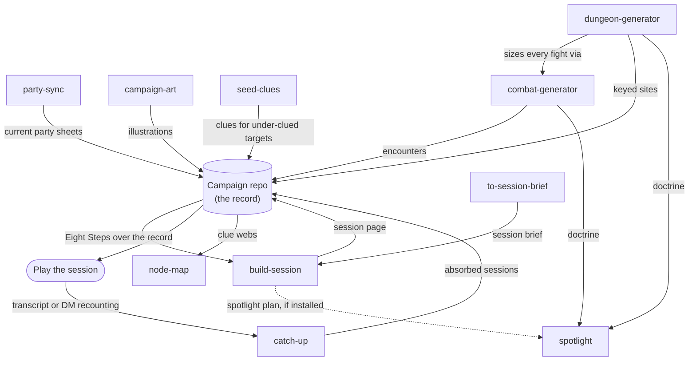

# dm-skills

Agent skills for prepping and running TTRPG sessions — compatible with fifth
edition. A campaign-agnostic library of D&D DM-craft skills: session prep on
Mike Shea's Eight Steps, non-linear dungeons, XP-budgeted combats, clue webs
and node maps, spotlight doctrine, and the record-keeping around them.

The library is laid out to the
[`skills` CLI](https://github.com/vercel-labs/skills) conventions: each skill
lives at `skills/<name>/SKILL.md` (frontmatter: `name`, `description`) plus
any reference files its skill text points at.

## Quickstart

**1. Install the skills** into the agent you run your campaign with:

```bash
npx skills add bmoo/dm-skills          # everything
npx skills add bmoo/dm-skills --skill build-session
npx skills update
```

Or skip the CLI and copy `skills/<name>/` folders straight into your agent's
skills directory — each folder ships everything its skill text points at.

**2. Point them at a campaign repo.** The skills learn a campaign by
**discovery**: they read the campaign repo's own guide (`CLAUDE.md` or
equivalent) and the docs it points to — no required directories, page types,
or manifest. Start with a repo whose guide says where your planning notes and
session records live; when a skill can't resolve something, it degrades per
its stated fallback or asks you inline and offers to record the answer so the
next run discovers it. The full menu of slots a campaign's docs can answer is
[docs/campaign-contract.md](docs/campaign-contract.md).

To see a wired campaign, browse
[`examples/emberwick-vale/`](examples/emberwick-vale/) — a small invented
campaign frozen just after its first session. Its `CLAUDE.md` answers every
contract slot (including the "we don't keep that" ones), and its played
session page shows the formats the skills read and write.

Starting from an empty repo instead? Ask your agent to run `setup`. After
checking that your D&D content tools answer lookups, it offers
to scaffold a planning wiki at the repo root — the `nodes/` skeleton
(locations, factions, npcs, events), plus `story/`, `sessions/`, `players/`, a
chronological `log.md`, a self-contained schema doc (`wiki-schema.md`), and
catalog + conformance scripts — then, with your consent, appends the block to
your `CLAUDE.md` that points discovery at it. Nothing about it is required:
discovery stays the mechanism, and the scaffold is simply the answer discovery
finds in a bootstrapped repo. Rename or rearrange any of it and you stay in
contract, so long as your guide says where things went. The offer is skippable
and safe to rerun, and it refuses to touch a repo that already has a wiki.

**3. Rules lookups work out of the box — no rules server required.** Skills
that source rules content follow the lookup chain in `lib/rules-sourcing.md`
(shipped into each skill that needs it): they prefer whatever D&D content
tools your environment has installed — any rules MCP server is an upgrade,
not a prerequisite — and fall back to the bundled SRD 5.2 dataset
(`lib/srd/`, CC-BY-4.0 with attribution).

Then start prepping: ask your agent to prep the next session
(`build-session`), generate a dungeon or a fight (`dungeon-generator`,
`combat-generator`), vet the magic items prep may hand out
(`review-rewards`), or absorb what happened last time (`catch-up`).

### Dependency clusters — install these together

**A single-skill install is supported, but three skills are not standalone.**
They reach across a skill boundary: `combat-generator` and `dungeon-generator`
open spotlight's doctrine files mid-step, and `dungeon-generator` sizes every
fight by invoking `combat-generator`. Install one of those alone and it breaks
partway through a run — a dangling relative link, or a delegate that isn't
there. Install the whole cluster instead:

```bash
# spotlight cluster — fights and keyed sites
npx skills add bmoo/dm-skills --skill combat-generator --skill spotlight
npx skills add bmoo/dm-skills --skill dungeon-generator --skill combat-generator --skill spotlight
```

Everything else stands alone. `spotlight`, `catch-up`, `node-map`,
`seed-clues`, `campaign-art`, `party-sync`, `review-rewards` and
`to-session-brief` have no hard dependency, and **`--skill build-session` on its own stays honest**: every one
of its cross-skill edges is guarded by *"if installed"*, so it degrades to
lean-sheet and page-building duties and hands nothing off. What each skill
loses when a soft dependency is absent — `build-session` without `spotlight`
skips the session spotlight plan; `party-sync` without it skips the
Spotlight-profile refresh — is declared edge by edge in
[docs/campaign-contract.md](docs/campaign-contract.md#dependency-clusters--what-a-selective-install-needs),
which `lib/dependency_clusters.py` holds to the tree and to the commands above.

## How the skills fit together

The library runs a loop around your campaign repo: prep writes pages into the
record, play happens at the table, and what happened gets absorbed back in
before the next prep. Solid arrows are hard edges (the spotlight cluster);
dotted arrows degrade gracefully when the target skill isn't installed.



## Roster

- **`setup`** — first run in a campaign repo: surveys and smoke-tests the
  environment's D&D content tools (connecting one stays optional — the
  bundled SRD already answers rules lookups), then offers the planning-wiki
  scaffold described above, leaving you a repo whose catalog and conformance
  check pass from the first commit. Every phase is offered, skippable, and
  safe to rerun.
- **`build-session`** — the one skill that owns session pages: traverses the
  Eight Steps of Lazy DM Prep against the campaign record and compiles the
  result into a durable session page (or stops at a lean sheet). Carries the
  library's single statement of the session-page format and an optional PDF
  renderer.
- **`catch-up`** — absorbs played sessions into the campaign record, from a
  transcript when one exists, by interviewing the DM otherwise.
- **`combat-generator`** — combats sized to the party's action economy with
  the SRD 5.2 XP-budget table, grounded in a campaign-record node, carrying a
  complication and a spotlight texture.
- **`dungeon-generator`** — complete, runnable non-linear keyed sites with
  party-balanced fights, a dungeon-wide mechanic, and setting-true rewards.
- **`node-map`** — high-level ASCII node-flow diagrams: nodes, hub, branch,
  and the clue/lead edges between them.
- **`seed-clues`** — seeds clues toward an under-clued target: a revelation
  short on evidence, or a node short on leads.
- **`spotlight`** — spotlight doctrine ("shoot your monks"): aim situations
  at a PC's build, audit prep for spotlight coverage and repeated tells.
- **`party-sync`** — keeps the party cache JSON and each player page's
  Character section current so other skills work from current sheets.
- **`campaign-art`** — campaign illustrations (portraits, locations, items,
  scenes) via an image-generation model, anchored to the campaign's own style.
- **`to-session-brief`** — turns a planning conversation into a **session
  brief** — the contract of hard-to-reverse decisions a session build is held
  to — and publishes it to the campaign's tracker. Explicitly invoked
  (`/to-session-brief`), never model-routed.

The campaign-agnostic contract the skills follow — the discovery slots a
campaign repo's docs should answer — is indexed in
[docs/campaign-contract.md](docs/campaign-contract.md).

## Design ground rules

- **Campaign-agnostic**: no required directories, page types, or
  campaign-record structures. Skills discover a campaign repo's shape from its
  own docs and degrade gracefully (or ask) when a structure is absent.
- **Config doctrine**: campaign facts live in the campaign repo; personal
  secrets live at user level (`~/.config/dnd-skills/`); the installed skill
  folder is read-only at runtime.
- **Writing conventions**: Matt Pocock's writing-great-skills guidelines.

## Maintainers

Everything below `docs/` and `lib/` beyond the two files linked above is
maintainer machinery, not consumer surface:

- `docs/eval-assertion-inventory.md` is the master list of every checkable
  promise the skills make; the runtime verifier (judgement rubrics, corpus
  verdict-maps, `lib/mechanical-checker/`) is derived from it, never
  hand-authored. `CLAUDE.md` states the sync rules.
- **`pytest lib/` is the gate on every content commit** — it holds citation
  anchors, retired phrases, and dependency clusters to the tree.
- Maintainer tooling in `.claude/skills/` never ships.

## License and attribution

Code is MIT ([`LICENSE-MIT`](LICENSE-MIT)); skill prose is CC-BY-4.0
([`LICENSE-CC-BY-4.0`](LICENSE-CC-BY-4.0)). [`NOTICE.md`](NOTICE.md) carries
the attribution notices in full.

This work includes material from the System Reference Document 5.2.1
("SRD 5.2.1") by Wizards of the Coast LLC, available at
https://www.dndbeyond.com/srd. The SRD 5.2.1 is licensed under the Creative
Commons Attribution 4.0 International License, available at
https://creativecommons.org/licenses/by/4.0/legalcode.

*dm-skills is unofficial Fan Content permitted under the Fan Content Policy.
Not approved/endorsed by Wizards. Portions of the materials used are property
of Wizards of the Coast. ©Wizards of the Coast LLC.*
