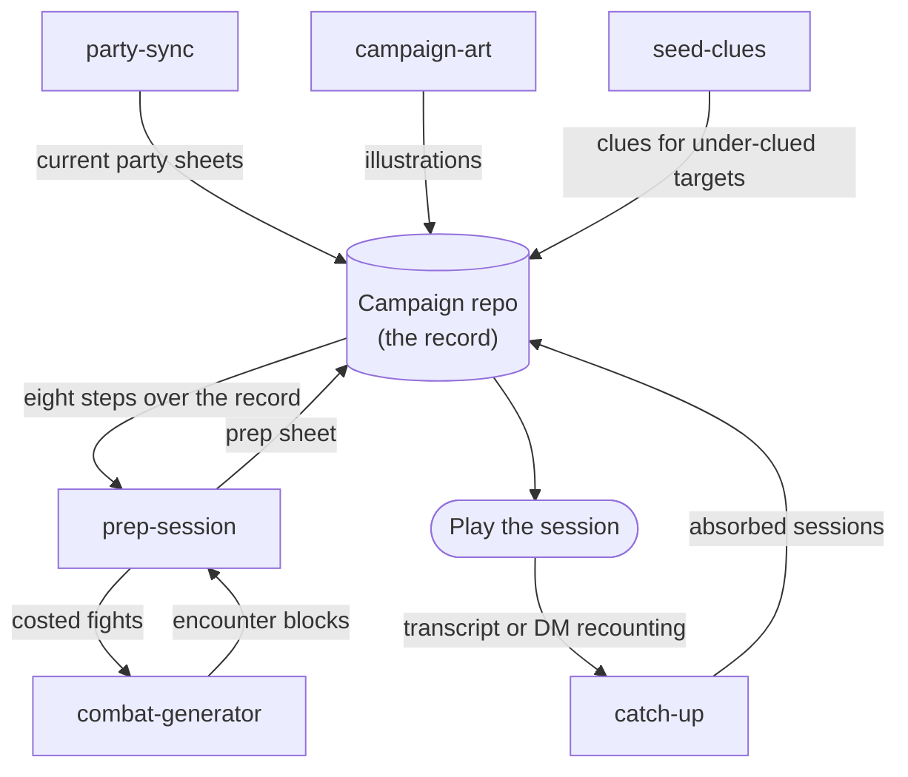

# dm-skills

Agent skills for prepping and running TTRPG sessions — compatible with fifth
edition. A campaign-agnostic library of D&D DM-craft skills: session prep on
Mike Shea's eight steps, XP-budgeted combats, clue webs and node maps,
spotlight doctrine for fights, and the record-keeping around them.

The library is laid out to the
[`skills` CLI](https://github.com/vercel-labs/skills) conventions: each skill
lives at `skills/<name>/SKILL.md` (frontmatter: `name`, `description`) plus
any reference files its skill text points at.

## Quickstart

**1. Install the skills** into the agent you run your campaign with:

```bash
npx skills add bmoo/dm-skills          # everything
npx skills add bmoo/dm-skills --skill prep-session
npx skills update
```

Or skip the CLI and copy `skills/<name>/` folders straight into your agent's
skills directory — each folder ships everything its skill text points at.

**Pinning a version.** Releases are tagged; `v0.2` is the first, cut at the
commit that closed the OKF v0.2 scaffold work. The `skills-lock.json` the CLI
writes records only each skill's source, skill path and a content hash, not
the tag or commit it came from, so a campaign repo should record that itself.
One convention that works: whenever you vendor or re-vendor, add a one-line
entry to the campaign's log such as `vendored dm-skills v0.2 (commit abc1234)`.
Find the commit a tag points at with either of:

```bash
git ls-remote https://github.com/bmoo/dm-skills refs/tags/v0.2
gh api repos/bmoo/dm-skills/git/refs/tags/v0.2
```

**2. Point them at a campaign repo.** The skills learn a campaign by
**discovery**: they read the campaign repo's own guide (`CLAUDE.md` or
equivalent) and the docs it points to — no required directories, page types,
or manifest. Start with a repo whose guide says where your planning notes and
session records live; when a skill can't resolve something, it degrades per
its stated fallback or asks you inline and offers to record the answer so the
next run discovers it. The full menu of slots a campaign's docs can answer is
[docs/campaign-contract.md](docs/campaign-contract.md).

To see a wired campaign, browse
[`examples/emberwick-vale/`](examples/emberwick-vale/) — a small invented
campaign frozen just after its first session. Its `CLAUDE.md` answers every
contract slot (including the "we don't keep that" ones), and its played
session record shows the formats the skills read and write.

Starting from an empty repo instead? Ask your agent to run `setup`. After
checking that your D&D content tools answer lookups, it offers
to scaffold a planning wiki at the repo root — the `nodes/` skeleton
(locations, factions, npcs, events), plus `story/`, `sessions/`, `players/`, a
chronological `log.md`, a self-contained schema doc (`wiki-schema.md`), and
catalog, conformance, and maintenance scripts — then, with your consent,
appends the block to your `CLAUDE.md` that points discovery at it. Nothing about it is required:
discovery stays the mechanism, and the scaffold is simply the answer discovery
finds in a bootstrapped repo. Rename or rearrange any of it and you stay in
contract, so long as your guide says where things went. The offer is skippable
and safe to rerun, and it refuses to touch a repo that already has a wiki.

**3. Rules lookups work out of the box — no rules server required.** Skills
that source rules content follow the lookup chain in `lib/rules-sourcing.md`
(shipped into each skill that needs it): they prefer whatever D&D content
tools your environment has installed — any rules MCP server is an upgrade,
not a prerequisite — and fall back to the bundled SRD 5.2 dataset
(`lib/srd/`, CC-BY-4.0 with attribution).

Then start prepping: ask your agent to prep the next session
(`prep-session` — a short Lazy DM sheet, each costed fight via the
`combat-generator` skill), vet the magic items prep may hand out
(`review-rewards`), or absorb what happened last time (`catch-up`).

**Every skill installs alone.** No skill has a hard dependency on another:
every optional cross-skill step is offered only when its companion is installed,
and the rest of the skill degrades gracefully without it.

## How the skills fit together

The library runs a loop around your campaign repo: prep writes a sheet into
the record, play happens at the table, and what happened gets absorbed back
in before the next prep.



## Roster

- **`setup`** — first run in a campaign repo: surveys and smoke-tests the
  environment's D&D content tools (connecting one stays optional — the
  bundled SRD already answers rules lookups), then offers the planning-wiki
  scaffold described above, leaving you a repo whose catalog and conformance
  check pass from the first commit. Every phase is offered, skippable, and
  safe to rerun.
- **`prep-session`** — the one prep skill: traverses Mike Shea's eight
  steps of lazy prep against the campaign record and writes a short prep
  sheet (`sessions/<slug>.md`) the DM reads in a few minutes before play —
  strong start, potential scenes, secrets and clues, fantastic locations,
  important NPCs, relevant monsters, PC-anchored rewards. Lists monsters by
  default and hands only the fights the DM wants costed to
  `combat-generator`. Ships a format lint and nothing heavier.
- **`combat-generator`** — builds one fight as a situation, not a script:
  sized to the party's action economy with the SRD 5.2 XP-budget table,
  grounded in the campaign's own setting, carrying at least one
  complication and a spotlight texture ("shoot your monks"), delivered with
  its machine-readable encounter-meta filing block — **pinned** to its
  scene, or **floating**: scene-free, written in roles, bound to a scene at
  the table. Runs standalone or invoked by `prep-session`
  (`/combat-generator`).
- **`catch-up`** — absorbs played sessions into the campaign record, from a
  transcript when one exists, by interviewing the DM otherwise.
- **`groom-wiki`** — maintains a scaffolded campaign wiki after absorption or
  on demand: applies mechanical fixes, places unresolved findings where prep
  reads them, and writes one `Lint` entry. `--dry-run` places and logs nothing;
  neither mode commits.
- **`seed-clues`** — seeds clues toward an under-clued target: a revelation
  short on evidence, or a node short on leads.
- **`party-sync`** — keeps the party cache JSON and each player page's
  Character section current so other skills work from current sheets.
- **`campaign-art`** — campaign illustrations (portraits, locations, items,
  scenes) via an image-generation model, anchored to the campaign's own style.

The campaign-agnostic contract the skills follow — the discovery slots a
campaign repo's docs should answer — is indexed in
[docs/campaign-contract.md](docs/campaign-contract.md).

## Design ground rules

- **Campaign-agnostic**: no required directories, page types, or
  campaign-record structures. Skills discover a campaign repo's shape from its
  own docs and degrade gracefully (or ask) when a structure is absent.
- **Config doctrine**: campaign facts live in the campaign repo; personal
  secrets live at user level (`~/.config/dm-skills/`); the installed skill
  folder is read-only at runtime.
- **Writing conventions**: Matt Pocock's writing-great-skills guidelines.

## Maintainers

Everything below `docs/` and `lib/` beyond the two files linked above is
maintainer machinery, not consumer surface:

- The runtime verifier lives at `lib/mechanical-checker/` and materialises
  into combat-generator by symlink (`scripts/mechanical_checker`); its README
  describes the checks, test gate, and extension procedure.
- **`pytest checks/ lib/mechanical-checker skills/prep-session/scripts/
  skills/review-rewards/scripts/` is the gate on every content commit** — it
  runs checks over shipped content and the units that ship with the skills.
- Maintainer tooling in `.claude/skills/` never ships.

## License and attribution

Code is MIT ([`LICENSE-MIT`](LICENSE-MIT)); skill prose is CC-BY-4.0
([`LICENSE-CC-BY-4.0`](LICENSE-CC-BY-4.0)). [`NOTICE.md`](NOTICE.md) carries
the attribution notices in full.

This work includes material from the System Reference Document 5.2.1
("SRD 5.2.1") by Wizards of the Coast LLC, available at
https://www.dndbeyond.com/srd. The SRD 5.2.1 is licensed under the Creative
Commons Attribution 4.0 International License, available at
https://creativecommons.org/licenses/by/4.0/legalcode.

*dm-skills is unofficial Fan Content permitted under the Fan Content Policy.
Not approved/endorsed by Wizards. Portions of the materials used are property
of Wizards of the Coast. ©Wizards of the Coast LLC.*
