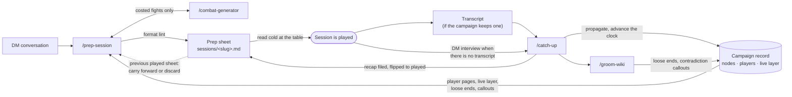

# Session prep-and-play workflow

Status: accepted. Ratified against shipped skill text at `b7bf0df` (the
`prep-session` swap, PR #95). Supersedes the 2026-07 OmniGraffle transcription,
which lives in git history.

## Decision

The library runs **one loop** around the campaign record: `prep-session` writes
a prep sheet, the session is played, `catch-up` absorbs what happened, and
`groom-wiki` maintains the record. One prep artifact, one record, one absorber.
There is no brief, no session issue, no validator, and no candidate/published
distinction: the sheet is checked by a format lint and nothing heavier, and a
premise that needs confirming is asked in chat.

`/wayfinder` sits outside the loop. It is an external skill
(`mattpocock-skills` plugin, human-invoked) that resolves campaign-scale
ambiguity into the record; nothing in this repo declares or requires it.
Campaign-scale decisions — the hook, the truths, the fronts, the next horizon —
live in the record and are made there, with or without it.

## What the loop asserts

**The record is the memory, not the sheet.** This is the library's departure
from Shea, whose memory is last session's one-page sheet and whose durable
pages refresh every few sessions. The sheet is throw-away prep: the record's
answer to "what does tonight need", read in minutes, abandonable at the
table without loss (`prep-session`, *Read the campaign first*).

**Current before prep is our rule, not Shea's.** Every planning artifact
reaches current before prep starts, because prep against a stale record is
prep against a false world (`catch-up`, opening). The live layer's progress
marker is how prep detects a played session not yet absorbed; `prep-session`
finishes absorbing it first, and asks the DM to bring the record current when
`catch-up` is not installed.

**Catch-up records; prep selects; nothing carried is owed.** `catch-up`
writes consequences freely, proposes reactions, and surfaces overdue beats,
loose ends, and re-clueing handoffs as flags. `prep-session` reads all of it
and the previous played sheet, carries forward what is still relevant and not
yet revealed, and discards the rest. Loose ends are candidates, never
obligations (`prep-session`, *Read the campaign first*). This asymmetry is
what keeps the live layer from becoming the stockpile Shea warns against.

**The sheet is written after play by catch-up alone.** `prep-session` files
it as `status: draft`. `catch-up` files the recap onto it, marks each fight's
staged opportunities fired or denied, records reward receipts, and flips it
to played history: `status: stable`, the `played` tag, the actual
`session_date`, and no `stale_after` (`catch-up`, steps 4 and 5; the schema's
*Session horizon*). Unplayed prep never flows onto node pages — the schema's
rebuild test — so the only edge from the sheet back into the record is
catch-up's propagate step after play.

**Transcripts are optional evidence, never canon.** A transcript is the
library's written form of Shea's oral, player-owned recap. When one exists,
`catch-up` reads it against the played sheet and the live layer, dockets every
divergence, and interviews only the gaps; when none exists, the played sheet is
the questionnaire. Either way nothing from the account lands on a page until
its divergences pass reconciliation, and catch-up never picks how a
discrepancy resolves (`catch-up`, hard rules and step 2). Where transcripts
land is a campaign slot (`docs/campaign-contract.md`), not a loop requirement.

**`stale_after` is the loop's clock, not a gate.** With no brief and no
validator between prep and play, the session horizon is the one thing that
tells the next prep a session night has passed. The live layer owns
`next_session`; `catch-up` writes it and the derived `stale_after` at the end
of an absorption; a sheet copies the value at build and loses it at
absorption; `prep-session` rolls the date forward when a night was cancelled;
`groom-wiki` only reports staleness (schema, *Session horizon* and its
ownership table). A bundle without a live layer uses neither field, and the
loop still runs — the progress-marker check catches unabsorbed play on its
own.

**Contradictions stay visible until settled.** The groomer places paired
callouts and never resolves them; `catch-up` clears only a pair the absorbed
session actually settled; `prep-session` carries an unresolved pair as a prep
gap in chat and leaves the callouts intact. This is the written form of
"let the world and the NPCs react to the characters' actions", and it adds no
doctrine Shea contradicts.

## Considered and rejected

- **A brief or session issue as prep's specification.** The eight steps are
  the specification; the sheet's inputs are the record and the conversation.
- **A validator judging sheet content.** Prep is thrown away after play; a
  content gate on it costs more than the sheet. The format lint checks shape
  only.
- **Fresh secrets every session.** Shea's original doctrine, which he revised
  in 2023 to carry forward; the loop draws the previous-sheet edge instead.
- **Rewriting the sheet as a living document after play.** Only catch-up
  writes to a played sheet, and only the recap and lifecycle. What the DM
  scribbles at the table is theirs.

## Sources

The method is Mike Shea's, from the CC-BY-4.0 *Lazy GM's Resource Document*
and freely published Sly Flourish articles; the comparison that shaped this
document is `docs/research/lazy-gm-campaign-loop.md` on branch
`research/lazy-gm-campaign-loop` (`aa95667`). The departures named above are
the library's own.
