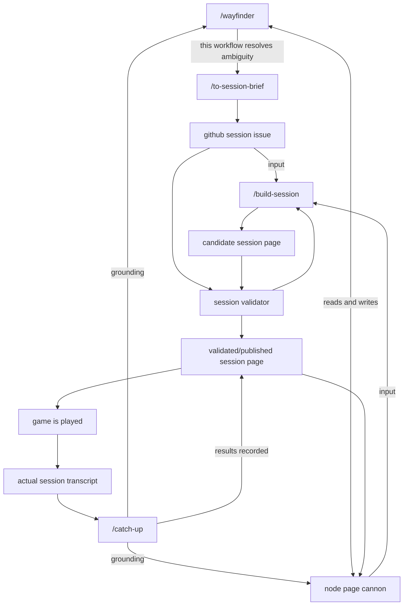

# Session prep-and-play workflow

Status: recorded from a design sketch, not yet ratified against shipped skill text.

## Context

The owner drew this workflow in OmniGraffle 8 on iPad (`D&D Planning Workflow.graffle`,
last modified 2026-07-27, synced through iCloud). It is the first end-to-end picture
of how the library's skills compose across a full cycle — from an ambiguous campaign
question, through session prep, into play, and back out as recorded results.

This document is a faithful transcription of that diagram plus the two discrepancies
transcription surfaced. It is **not** a record of alternatives weighed: the sketch
shows one design and does not argue against others, so no such argument is invented here.

`CONTEXT.md` was the first-considered home and is the wrong one by its own charter —
it is a glossary that excludes specs and decisions. A workflow design belongs here.

## The workflow

Eleven nodes and seventeen directed edges. Directions below are read from each
connector's stored arrowhead, not from the visual rendering. Exactly one edge is
bidirectional; the other sixteen are single-headed.

### Nodes

Skill-shaped nodes are written with a leading slash in the diagram; the rest are
artifacts or events.

| Node | Kind |
| --- | --- |
| `/wayfinder` | skill, external — `mattpocock-skills` plugin, see below |
| `/catch-up` | skill (`skills/catch-up/`) |
| `/to-session-brief` | skill (`skills/to-session-brief/`) |
| `/build-session` | skill (`skills/build-session/`) |
| github session issue | artifact |
| candidate session page | artifact |
| session validator | process |
| validated/published session page | artifact |
| node page cannon | artifact — see the discrepancy below |
| game is played | event |
| actual session transcript | artifact |

### Edges

| From | To | Label |
| --- | --- | --- |
| `/catch-up` | `/wayfinder` | grounding |
| `/catch-up` | node page cannon | grounding |
| `/catch-up` | validated/published session page | results recorded |
| `/wayfinder` | `/to-session-brief` | this workflow resolves ambiguity |
| `/wayfinder` | node page cannon | reads and writes (bidirectional) |
| `/to-session-brief` | github session issue | — |
| github session issue | `/build-session` | input |
| github session issue | session validator | — |
| node page cannon | `/build-session` | input |
| `/build-session` | candidate session page | — |
| candidate session page | session validator | — |
| session validator | `/build-session` | — |
| session validator | validated/published session page | — |
| validated/published session page | node page cannon | — |
| validated/published session page | game is played | — |
| game is played | actual session transcript | — |
| actual session transcript | `/catch-up` | — |

### Shape of it

Three loops close:

- **Prep loop.** `/build-session` emits a candidate page, the session validator
  judges it against the github session issue, and rejection returns to
  `/build-session`. Nothing reaches publication without passing the validator.
- **Play loop.** A published page is played, play produces a transcript, the
  transcript re-enters through `/catch-up`, and `/catch-up` records results back
  onto the published page.
- **Canon loop.** The node page cannon is written by both `/wayfinder` and the
  published page, and read as grounding by `/catch-up` and as input by
  `/build-session`. It is the shared state the other two loops turn around.

`/wayfinder` sits ahead of everything: it resolves ambiguity, then hands off to
`/to-session-brief`, which files the github session issue that becomes prep's
specification.

## Notes on the sketch

**`/wayfinder` is external, and deliberately so.** Unlike the other three
slash-commands, it has no directory under `skills/` — it comes from the
`mattpocock-skills` plugin (`skills/engineering/wayfinder/`, version 1.2.0), which
plans work too big for one agent session as a shared map of decision tickets on the
repo's issue tracker. Its frontmatter sets `disable-model-invocation: true`, so it is
invoked by the human and never picked up autonomously — which is precisely the role
the diagram gives it, sitting ahead of the workflow and handing off once ambiguity
is resolved.

This is also the skill behind the planning maps this library was built from:
work too big for one agent session — the evaluation gate, the map-render design —
was mapped as decision tickets before being built. Those issue maps are not a
separate planning concept that happens to share the name — they *are* what
`/wayfinder` produces.

The library therefore depends on a skill it does not vendor. That dependency is
invisible to anything in this repo: nothing declares it, and nothing fails if the
plugin is absent.

**"node page cannon" is transcribed verbatim and reads as "canon."** The label is
kept as drawn. The since-removed `node-map` skill was the plausible owner of this
node; the diagram does not name one.
